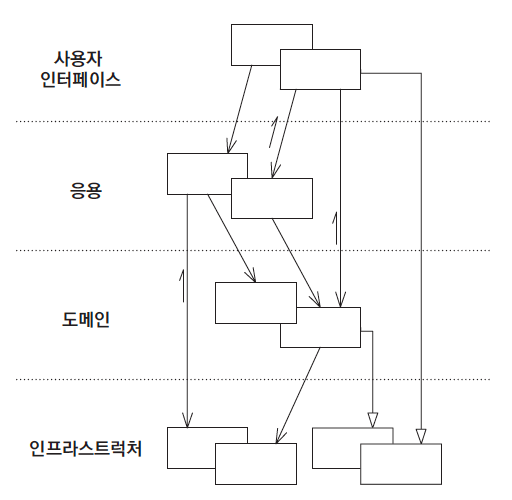

# 1장. 계층형 아키텍처의 문제는 무엇일까?

## 전통적인 계층형 아키텍처

- 계층형 아키텍처는 일반적으로 위와 같이 표현, 응용, 도메인, 인프라 계층으로 구성되어 있다.

## 계층형 아키텍처는 데이터베이스 주도 설계를 유도한다

- 비즈니스를 관장하는 규칙이나 정책을 반영한 모델은 행동이 상태를 바꾸는 주체가 되어 모델링된다.
- 그러나 ORM 프레임워크를 사용하면 즉시로딩, 지연로딩, 트랜잭션과 같은 영속성 계층 작업들이 도메인 코드에 녹아들어 영속성 모델을 비즈니스 모델처럼 사용하게 된다. 영속성 코드가 도메인 코드에 녹아들어가면 둘 중 하나만 바꾸기 어려워진다.

## 지름길을 택하기 쉬워진다

- 계층형 아키텍처에서는 "특정 계층에서는 같은 계층 또는 하위 계층에만 접근 가능하다"는 규칙 외 다른 규칙들을 강제하지 않는다.
- 상위 계층 컴포넌트에 접근할 필요성이 생겼을 때 하위 계층으로 내려버리면 된다. 이 상황이 지속되면 "깨진 유리창 이론"처럼 계속 악순환이 반복된다.

## 테스트 하기 어려워진다

- 계층형 아키텍처를 사용할 때 계층을 건너뛰게 되면 웹 계층 테스트시 도메인 계층뿐만 아니라 영속성 계층도 mocking해야하는 상황이 올 수 있으므로 테스트 설정이 지나치게 복잡해진다.

## 유스케이스를 숨긴다

- 유스케이스가 간단하여 도메인 계층을 생략하면 일관성 있게 새로운 기능을 추가할 위치를 찾기 어려워진다.
- 계층형 아키텍처는 도메인 서비스의 너비 규칙이 없으므로 비대한 서비스가 만들어 질 수 있다.
- 고도로 특화된 좁은 도메인 서비스가 유스케이스 하나씩만 담당하게 하면 개선의 여지가 있다.
  - e.g. 회원 서비스
    - UserService -> 회원가입, 탈퇴, 개인정보수정 -> RegisterUserService, DeregisterUserService, UpdateUserInfoService

## 동시 작업이 어려워진다.

- 계층형 아키텍처를 사용하면 모든 것이 영속성 계층 위에 만들어져 팀 단위로 작업을 분리하기 어려워진다.
- 넓은 서비스가 있다면 서로 다른 기능을 동시에 작업하기 어렵지만, 좁은 서비스를 여러개 가진다면 코드 충돌이 발생할 여지가 줄어들어 작업 단위를 분리하기 용이해진다.
