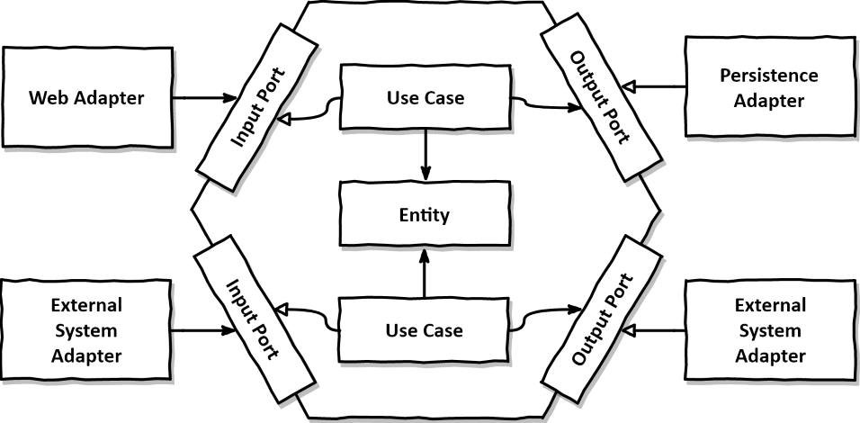

# 2장. 의존성 역전하기

## 단일 책임 원칙

- "컴포넌트를 변경하는 이유는 오직 하나뿐이어야 한다."

## 의존성 역전 원칙

- "코드상의 어떤 의존성이든 그 방향을 역전시킬 수 있다."
- 도메인 계층과 영속성 계층 간 의존성을 제거하기 위해 DIP를 적용할 수 있다.
- 서드파티 라이브러리에 의존성이 있다면 해당 라이브러리를 제어할 수 없기 때문에 의존성을 역전시킬 수 없다.
- 영속성 계층의 리포지토리가 도메인 계층에 있는 엔티티에 의존하는 문제를 해결하기 위해 리포지토리에 대한 인터페이스를 만든 후 구현체는 영속성 계층에서 만들 수 있다.

## 클린 아키텍처

- 설계가 비즈니스 규칙의 테스트를 용이하게 한다.
- 비즈니스 규칙은 프레임워크, 데이터베이스, UI기술, 외부 어플리케이션, 인터페이스로부터 독립적일 수 있다.
- 도메인 코드가 바깥으로 향하는 어떤 의존성도 없어야 한다.
- DIP의 도움으로 모든 의존성이 도메인 코드를 향한다.


- 아키텍처 코어에는 주변 유스케이스(서비스)에서 접근하는 도메인 엔티티가 있다.
- 유스 케이스는 서비스보다 좁은 단위를 다뤄 단일 책임을 가지도록 구성된다.
- 서드파티 컴포넌트를 지원하기 위해서 어댑터 계층을 제공한다.
- 도메인 코드에서 어떤 영속성 프레임워크나 UI 프레임워크가 사용되는지 알 수 없다.
  - 특정 프레임워크에 종속적인 코드를 가지지 않는다.
  - 비즈니스 규칙에 집중할 수 있다.
- 도메인 계층이 영속성이나 UI같은 외부 계층과 철저하게 분리돼야 하므로 엔티티에 대한 모델을 각 계층에서 유지보수 해야 한다.
  - ORM을 사용하는 경우 영속계층에서 사용하는 엔티티와 도메인 계층에서 사용하는 엔티티가 분리되어야 한다.
  - 도메인 계층과 영속성 계층이 데이터를 주고받을 때, 두 엔티티를 서로 변환해야 한다.
  - 이렇게 해야 비로소 도메인 모델이 프레임워크의 종속성으로부터 자유로워 질 수 있다.
  - 순수한 도메인 모델은 NoArgsConstructor를 만들 필요가 없어진다.

## 육각형 아키텍처 (헥사고날 아키텍처)



- 본질적으로 클린 아키텍처와 다르지 않다.
- 육각형 안에 도메인 엔티티와 이와 상호작용하는 유스케이스가 있다.
- 육각형에서 외부로 향하는 의존성은 없다. 대신 모든 의존성은 코어로 향한다.
- 육각형 바깥에 어플리케이션과 상호작용하는 다양한 어댑터가 있다.
  - e.g. 웹 브라우저, 외부 시스템, 데이터베이스 등
- 왼쪽에 있는 어댑터는 어플리케이션을 주도하는 어댑터다. (어플리케이션 코어를 호출)
- 오른쪽에 있는 어댑터는 어플리케이션에 의해 주도되는 어댑터다. (어플리케이션 코어에 의해 호출됨)
- 어플리케이션 코어와 어댑터 간에 통신하기 위해 어플리케이션 코어가 각각의 포트를 제공해야 한다.
- 주도하는 어댑터에게 포트는 어댑터에 의해 구현되고 코어에 의해 호출되는 인터페이스가 된다.

## 실습

e.g. 클린아키텍처에서 추구하는 방향으로 로그인 유스케이스 구현해보기

```typescript
/* 프레임워크 종속성 없는 도메인 모델 */
export class User {
  private _id: number;
  private _name: string;
  private _age: number;
  private _birth: Date;
  private _role: UserRole;

  shouldNotMatchedPassword(password: string, matcher: PasswordMatchStrategy): boolean {
    return matcher.matches(this.password, password);
  }
}
```

```typescript
/* 영속성 계층과 도메인 간 통신하기 위한 포트 */
export interface UserRepository {
  findById(id: number): Promise<User | undefined>
  ...
}
```

```typescript
/* 프레임워크 종속적인 엔티티 구현체 */
@Entity('user')
export class TypeOrmUser {
  @PrimaryGeneratedColumn('id')
  private _id: number

  @Column('name')
  private _name: string

  @Column({ name: 'age', type: 'integer' })
  private _age: number

  @Column({ name: 'birth', type: 'timestamp with timezone' }))
  private _birth: Date

  @Column({ name: 'role', type: 'enum', enum: UserRole }))
  private _role: UserRole
}
```

```typescript
/* 프레임워크 종속적인 리포지토리 구현체 */
@EntityRepository(TypeOrmUser)
export class TypeOrmUserRepository extends Repository<TypeOrmUser> {
  async findById(id: number): Promise<TypeOrmUser | undefined> {
    return this.findOne(id)
  }
  ...
}
```

```typescript
/* 도메인 모델과 영속성 간 매퍼 */
export class UserMapper {
  toEntity(user: User): UserEntity {
    return new UserEntity(user.id, user.name, user.age, user.birth, user.role);
  }

  toDomainModel(userEntity: UserEntity): User {
    return new User(userEntity.id, userEntity.name, userEntity.age, userEntity.birth, userEntity.role);
  }
}
```

```typescript
/* 어댑터 */
export class UserRepositoryImpl implements UserRepository {
  private readonly typeOrmUserRepository: TypeOrmUserRepository
  private readonly userMapper: UserMapper

  async findById(id: number): Promise<User> {
    const userEntity = await this.typeOrmUserRepository.findById(id)
    if (!userEntity) {
      throw new EntityNotFoundError('사용자를 찾을 수 없습니다.')
    }
    return userMapper.toDomainModel(userEntity)
  }
  ...
}
```

```typescript
export class LoginUserUseCase {
  private readonly userRepository: UserRepository;
  private readonly jwtProvider: JwtProvider;

  async login(request: LoginRequest): LoginResponse {
    const user = await this.userRepository.findByEmail(request.email);
    this.validatePassword(user, request.password);
    const token = jwtProvider.createToken(user.id, user.role);
    return new LoginResponse(token);
  }

  private validatePassword(user: User, password: string): void {
    if (user.shouldNotMatchedPassword(request.password)) {
      throw new LoginFailedError("로그인 할 수 없습니다.");
    }
  }
}
```
